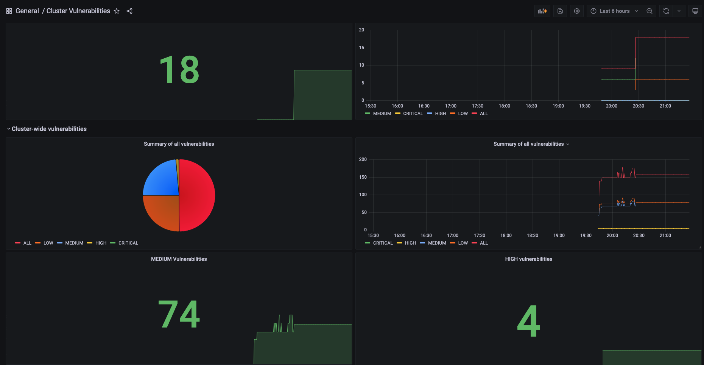
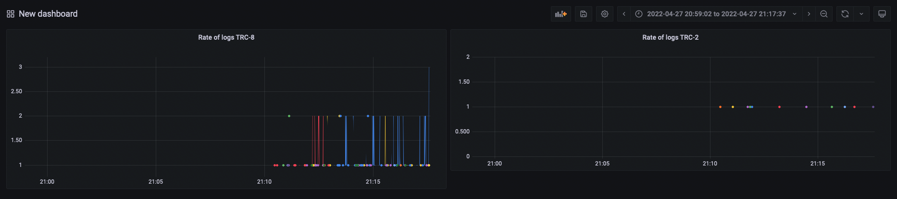

# Monitor your cluster security

This repository uses the following applications:
- [Prometheus Stack Helm Chart](https://github.com/prometheus-community/helm-charts/tree/main/charts/kube-prometheus-stack)
- [Grafana](https://grafana.com/)
- [Promtail & Loki](https://grafana.com/oss/loki/)
- [Trivy Exporter](https://github.com/giantswarm/starboard-exporter)
- [Trivy Helm Chart](https://github.com/aquasecurity/trivy-operator)
- [Tracee](https://github.com/aquasecurity/tracee)

## Overview

This repository is used in several different tutorials by [Anais Urlichs](https://github.com/AnaisUrlichs).
Check out her [website](https://anaisurl.com/) and [YouTube channel](https://www.youtube.com/c/AnaisUrlichs) for more information.

Specific links:
-  [Full Kubernetes tutorial on Docker, KinD, kubectl, Helm, Prometheus, Grafana](https://youtu.be/SeQevrW176A?si=wRS41uoMvmeO4DmU)

## Installing Prometheus 

Note: If you would like to install Prometheus with AlertManager, check out the example further below.

Create a monitoring namespace:
```
kubectl create ns monitoring
```

Install the helm prometheus stack chart:

```
helm repo add prometheus-community https://prometheus-community.github.io/helm-charts
```

```
helm repo update
```

```
helm upgrade --install prom prometheus-community/kube-prometheus-stack -n monitoring --values observability-conf/prom-values.yaml
```

Install promtail to collect logs from every node:

```
helm repo add grafana https://grafana.github.io/helm-charts
```

```
helm repo update
```

Install promtail

```
helm upgrade --install promtail grafana/promtail -f observability-conf/promtail-values.yaml -n monitoring
```

Install loki to collect all the logs from promtail:
```
helm upgrade --install loki grafana/loki-distributed -n monitoring
```

## Prometheus with AlertManager

To install Prometheus with AlertManager, we will have to change the configuration in the `kube-prometheus-stack` Operator Helm Chart.

The new `values.yaml` manifest can be found [here.](./observability-conf/prom-values-alertmanager.yaml)

Next, use the updated helm command:
```
helm upgrade --install prom prometheus-community/kube-prometheus-stack -n monitoring --values observability-conf/prom-values-alertmanager.yaml
```

## Installing the Trivy Operator

Install Trivy operator:
```
helm repo add aqua https://aquasecurity.github.io/helm-charts/
```

```
helm repo update
```

And finally, the Helm chart can be installed with the following command:

```
helm upgrade --install trivy-operator aqua/trivy-operator \
  --namespace trivy-system \
  --create-namespace \
  --set="trivy.ignoreUnfixed=true" \
  --set="serviceMonitor.enabled=true" \
  --version 0.20.2
```

Alternatively, it's also possible to set a custom values.yaml manifest that overrides the default values in the Helm Chart. We have set up the following [values.yaml](./observability-conf/trivy-values.yaml) manifest for the Trivy Operator. To provide the file upon installing the operator, use the following command:
```
helm upgrade --install trivy-operator aqua/trivy-operator \
  --namespace trivy-system \
  --create-namespace \
  --values ./observability-conf/trivy-values.yaml \
  --version 0.20.2
```

Make sure to cross-check the updated installation incl. the latest versio  of the operator in the docs: https://aquasecurity.github.io/trivy-operator/latest/operator/installation/helm/

## Tracee

Tracee can be added through the following instructions: https://aquasecurity.github.io/tracee/latest/tutorials/promtail/

## Open the dashboards in Grafana

You can then port-forward to grafana:
```
kubectl port-forward service/prom-grafana -n monitoring 3000:80
```

The login is:
    Username: admin
    Password: prom-operator

And provide Grafana with the dashboards in the [observability-conf](./observability-conf/) folder.
Note that Trivy also has a custom Dashboard -- [the ID: 17813 ]




